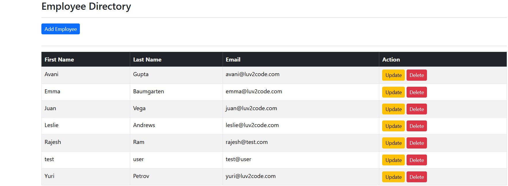
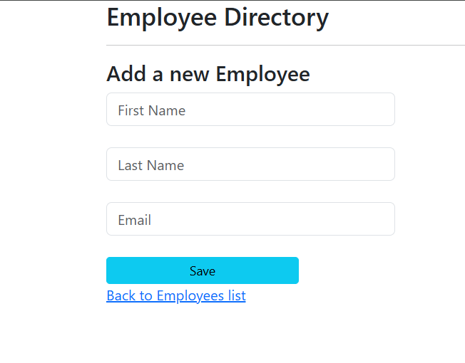
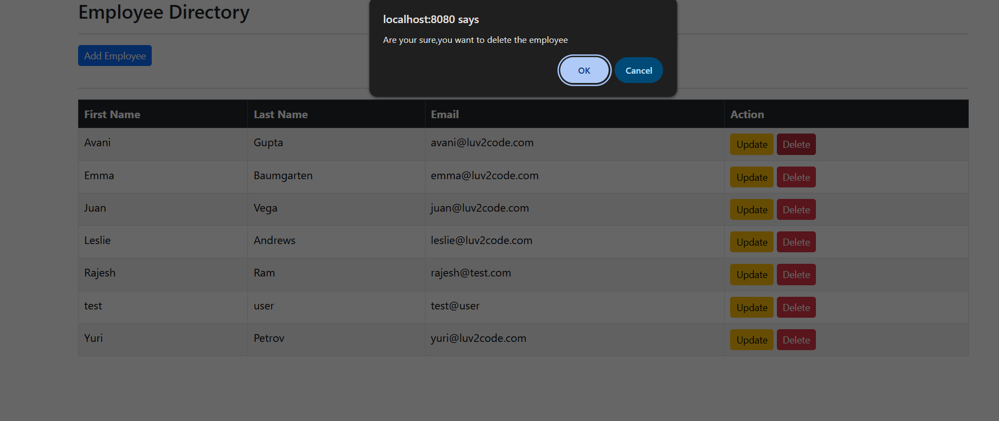

# Employee Management CRUD Application

A full-stack employee management app built using **Spring Boot**, **Thymeleaf**, **Spring Data JPA**, **MySQL**, and **Spring Validation**.

---

## ⭐️ Features

- Create, read, update, and delete employees
- Server-side validation (Spring Validation)
- Dynamic UI with Thymeleaf
- JPA/Hibernate ORM with MySQL
- MVC layered architecture

---

## 🛠 Tech Stack

- Spring Boot
- Spring MVC
- Thymeleaf
- Spring Data JPA
- MySQL
- Hibernate
- Spring Validation  

## 📸 Screenshots

### Home Page

### Add Employee Form

### Delete Employee Page
